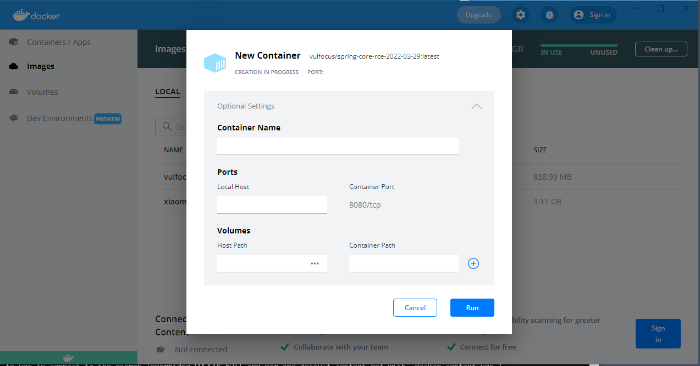

通常Docker镜像启动命令如下
```
docker run --name spring-core-rce -d -p 8080:8080 -p 22222:22222 ybdt/spring-core-rce
```
但是我们并不知道容器内部开放的端口是多少，也不确定容器内部开放几个端口

临时解决办法：  
借助Docker for Windows可以显示容器内部开放几个端口及端口号，如下图  


解决办法：
```
docker images
docker inspect 镜像名
```
如下图，显示内部开放几个端口及端口号
