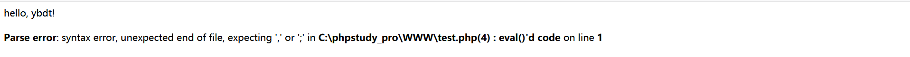

php中的@常用在函数前，用于屏蔽函数执行过程中的告警信息、错误信息，有UI美观的考虑，也有安全因素的考虑


```
<?php
eval("echo abc");
?>
```
上述代码将会报错，如下图：  


在函数前加上@
```
<?php
@eval("echo abc");
?>
```
上述代码将不会报错，如下图：  


参考链接：  
https://blog.csdn.net/tashanhongye/article/details/50187969?utm_medium=distribute.pc_relevant_t0.none-task-blog-2%7Edefault%7EBlogCommendFromMachineLearnPai2%7Edefault-1.control&dist_request_id=&depth_1-utm_source=distribute.pc_relevant_t0.none-task-blog-2%7Edefault%7EBlogCommendFromMachineLearnPai2%7Edefault-1.control
