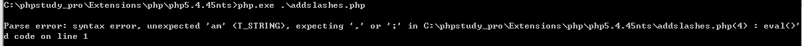

addslashes  

介绍：  
php 5.4.0之前默认开启magic_quotes_gpc，开启了magic_quotes_gpc就表示默认会对$_GET、$_POST、$_COOKIE获取的参数进行addslashes，这个时候就不能再对这些数据进行addslashes了，否则将会产生错误

实例：  
```
<?php
$str = "i'am ybdt";
eval("echo '" . addslashes($str) . "';");
?>
```
对$str中的单引号转义后，能够正常输出，如下图  

```
<?php
$str = "i'am ybdt";
eval("echo '" . $str . "';");
?>
```
没对$str中的单引号转义，则不能正常输出，如下图  

