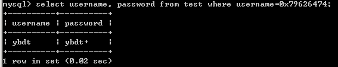
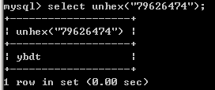

1、可用16进制形式代替它本身  
MySQL中可用字符串的十六进制形式代替它本身，比如正常的查询如下图  
  
'ybdt'的十六进制获取如下图  
  
在十六进制前面加上0x，即可等同于查询'ybdt'，如下图  
  
然后从十六进制获取字符串，如下图  
  
参考链接：  
https://blog.csdn.net/amber_o0k/article/details/81563321  
https://www.w3resource.com/mysql/string-functions/mysql-unhex-function.php
