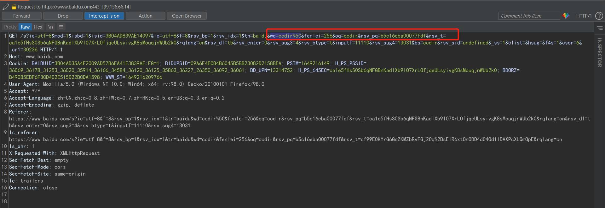

# 基本介绍
浏览器会自动对地址栏中的特殊字符进行URL编码，如在百度中搜索“ccdir”，地址栏是“ccdir”，但是在百度中搜索“ccdir&”，地址栏则是“ccdir%26”，如下图  
  

# 原理解释
特殊字符会引发歧义，浏览器对特殊字符进行URL编码后，WEB服务器会进行URL解码  
即使对正常字符进行URL编码，也能正确解释，原因是WEB服务器会对全部字符进行URL解码

浏览器会对哪些字符自动进行URL编码呢？
```
1、空格自动编码为%20
2、正斜杠/分隔目录和子目录
3、问号?分隔URL和查询
4、百分号%制定特殊字符
5、#号指定书签
6、&号分隔参数
```

# 有些网站为什么没有对指定字符进行编码？
测试发现，在百度中输入“ccdir\”，会自动进行URL编码，如下图
  
但在有的网站中则不会对“ccdir\”自动进行URL编码，如下图  
  

# 目前得到的结论
根据网站的不同，有的会自动进行URL编码，有的则不会自动进行URL编码，而且，不同网站自动编码的字符集可能也是不同的

# 参考链接
https://blog.csdn.net/pcyph/article/details/45010609  