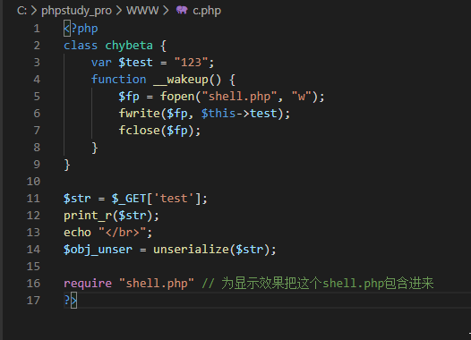

### 0x01 实验环境
win10_pro_x64  
phpstudy_8.1  
vscode  
firefox  

### 0x02 反序列化漏洞基本原理
当传给 unserialize() 的参数可控时，我们可以通过传入一个精心构造的序列化字符串，从而控制对象内部的变量甚至是函数。

### 0x03 反序列化漏洞用到的魔术方法
php中有一类特殊的方法叫魔术方法，这里我们着重关注以下几个：  
构造函数__construct()：创建对象时自动调用，但在unserialize()时不会自动调用  
析构函数__destruct()：销毁对象时自动调用  
序列化函数serialize()会检查类中是否存在一个魔术方法__sleep()，如果存在，该方法会先被调用，然后再执行序列化操作  
反序列化函数unserialize()会检查类中是否存在一个魔术方法__wakeup()，如果存在，该方法会先被调用，然后再执行反序列化操作  

测试代码如下  
```
<?php
class YBDT {
    public $test = "123";

    function __wakeup() {
        echo "Code here was execute in __wakeup()";
        echo "<br/>";
    }

    function __construct() {
        echo "Code here was execute in __construct()";
        echo "<br/>";
    }

    function __destruct() {
        echo "Code here was execute in __destruct()";
        echo "<br/>";
    }
}
$ybdt = new YBDT();
$serialized_obj = serialize($ybdt);
print_r($serialized_obj);
```
输出如下  
```
Code here was execute in __construct()
O:4:"YBDT":1:{s:4:"test";s:3:"123";}Code here was execute in __destruct()
```
如下图  
  


## 利用场景
__wakeup()
由前可以看到，unserialize()前会导致__wakeup()的直接调用，中间无需其他过程。因此最理想的情况是一些漏洞/危害代码在__wakeup()中，从而当我们控制序列化字符串时可以去直接触发它们。这里针对 __wakeup()场景做个实验。假设源码如下：  
  
同目录下有个空的shell.php文件。一开始访问c.php。  
  
基本的思路是，本地搭建好环境，通过 serialize() 得到我们要的序列化字符串，之后再传进去。通过源代码知，把对象中的test值赋为 “<?php phpinfo(); ?>”,再调用unserialize()时会通过__wakeup()把test的写入到shell.php中。为此我们写个php脚本：  
  
由此得到序列化结果：  
  
这里想执行phoinfo();会有一个坑，参见附录1  
  

## 其他Magic function的利用
但如果一次unserialize()中并不会直接调用的魔术函数，比如前面提到的__construct()，是不是就没有利用价值呢？非也。类似于PWN中的ROP，有时候反序列化一个对象时，由它调用的__wakeup()中又去调用了其他的对象，由此可以溯源而上，利用一次次的“gadget”找到漏洞点。  
  
这里我们给test传入构造好的序列化字符串后，进行反序列化时自动调用 __wakeup()函数，从而在new ph0en1x()会自动调用对象ph0en1x中的__construct()方法，从而把<?php phpinfo() ?>写入到 shell.php中。  
  

## 利用普通成员方法
前面谈到的利用都是基于“自动调用”的magic function。但当漏洞/危险代码存在类的普通方法中，就不能指望通过“自动调用”来达到目的了。这时的利用方法如下，寻找相同的函数名，把敏感函数和类联系在一起。  
  
本意上，new一个新的chybeta对象后，调用__construct()，其中又new了ph0en1x对象。在结束后会调用__destruct()，其中会调用action()，从而输出 ph0en1x。  
下面是利用过程。构造序列化。  
  
得到：  
  

# 附录1
1、浏览器访问解析后的php代码，不能显示<?php phpinfo(); ?>，进一步测试，不能显示<?、<php、等，所以想显示上述输出，需要在控制台下显示输出  
2、通过get、post、cookie传入的数据，当包含【'】【"】【\】【NULL】这4个字符时，会被自动加入反斜线转义  
应对方式stripslashes()、magic_quotes_gpc = Off

# 参考链接
https://chybeta.github.io/2017/06/17/%E6%B5%85%E8%B0%88php%E5%8F%8D%E5%BA%8F%E5%88%97%E5%8C%96%E6%BC%8F%E6%B4%9E/  
https://xz.aliyun.com/t/6753

参考链接：  
https://www.php.net/manual/zh/language.oop5.magic.php  
